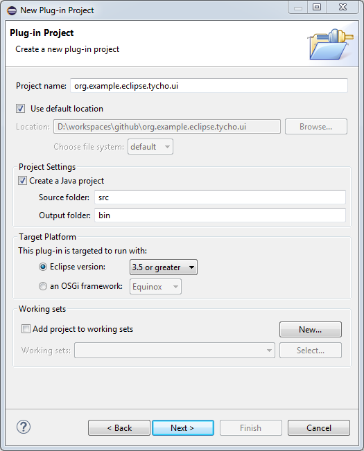
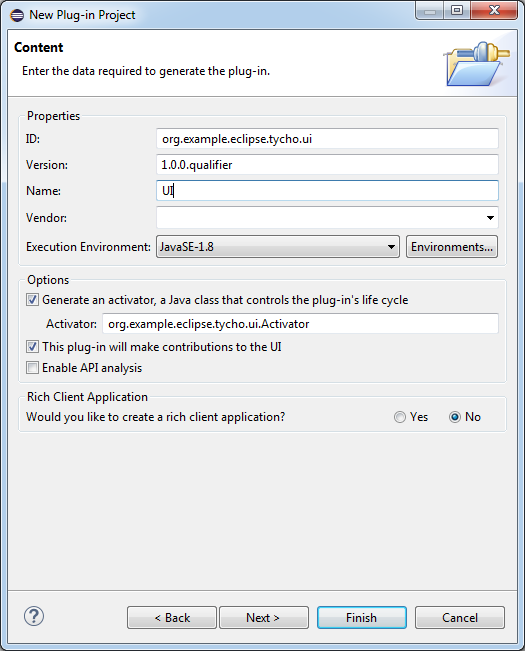
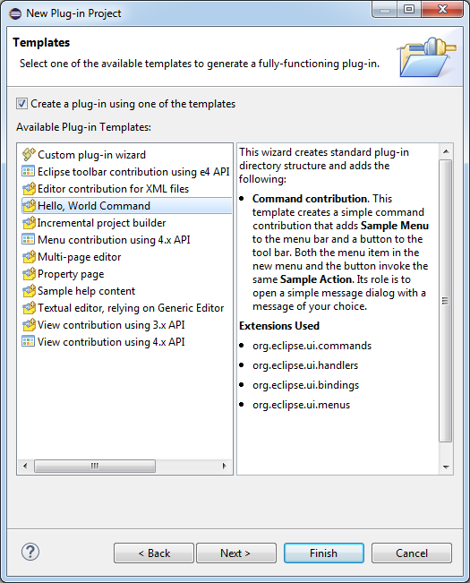
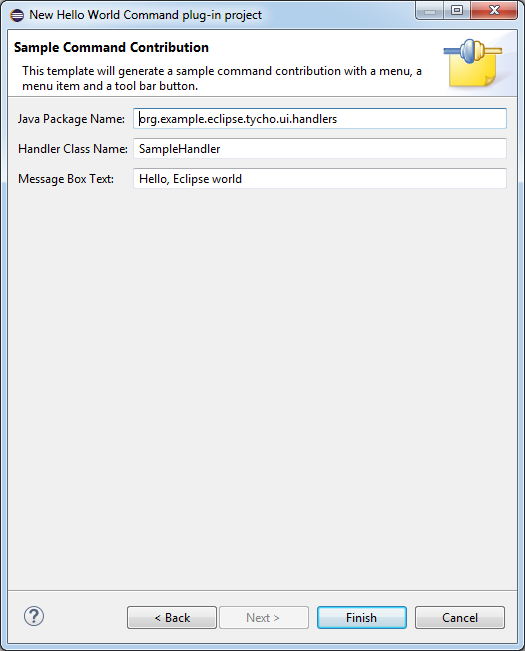
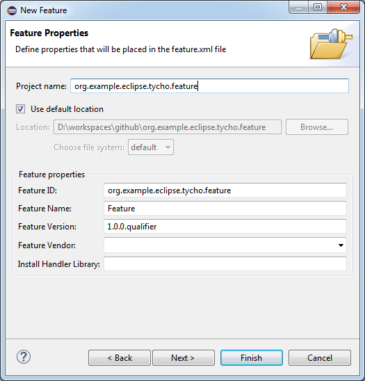
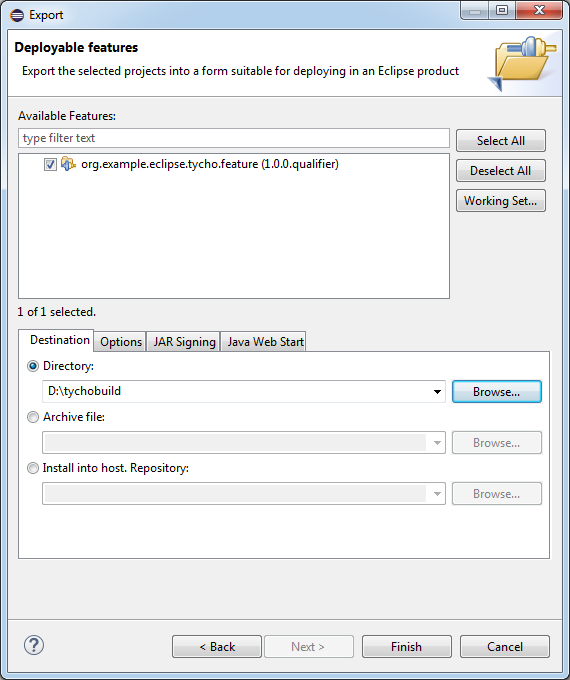
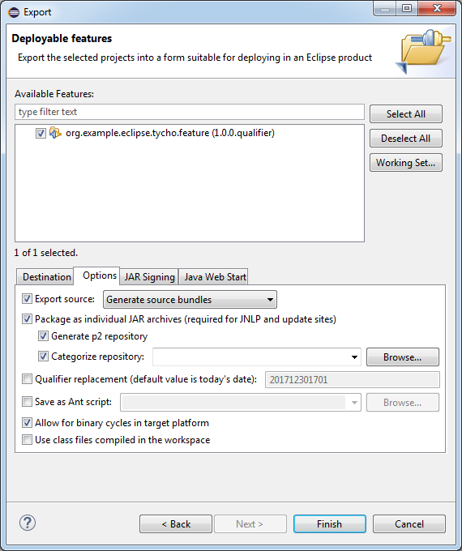
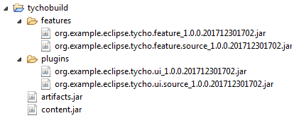

# eclipse-tycho

How to add tycho to an existing eclipse plugin feature...

## Adding Tycho

Below I describe in _Setting up your own project_ the prerequisites of these directions. 
I start with a basic Eclipse feature project and a basic Eclipse plug-in project.

##### Create Parent POM 

_coming soon..._

##### Add a Target Definition as a Maven Module

_coming soon..._

##### Add a Category Manifest as a Maven Module

_coming soon..._

##### Add POMs for the existing Feature and UI Plug-Ins

_coming soon..._

##### Launch Configurations

## Setting up your own project

I used Eclipse Oxygen 2 to create the project:

##### Create a Plug-in

The following wizard creates a simple plug-in...

 
 
 
 

##### Create a Feature

Include the plug-in in the feature... 

 
 

##### Export as p2 repository

Basically Eclipse provides everything to create a p2 repository

 
 

This yields a folder structure like:

 

##### Share into a GIT repository

Now you can share the plug-ins into an existing GIT repository with the standard **EGit** share command. 
So far so good.

Now I prepare the next step to add the Maven POMs: I transform the root of the GIT repository to an
Eclipse project. To make it importable I add a `.project` file with the following content. This creates
a Maven parent project, adding the Maven2 builder and nature. We do not need it yet but this gives a nice 
starting point for adding the Maven Tycho build in the next step.

	<?xml version="1.0" encoding="UTF-8"?>
	<projectDescription>
		<name>org.example.eclipse.tycho.parent</name>
		<comment></comment>
		<projects>
		</projects>
		<buildSpec>
			<buildCommand>
				<name>org.eclipse.m2e.core.maven2Builder</name>
				<arguments>
				</arguments>
			</buildCommand>
		</buildSpec>
		<natures>
			<nature>org.eclipse.m2e.core.maven2Nature</nature>
		</natures>
	</projectDescription>

 