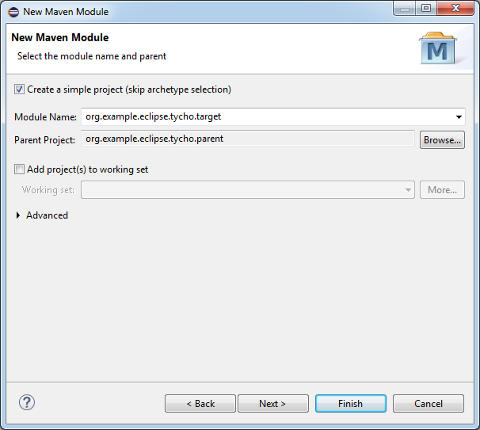
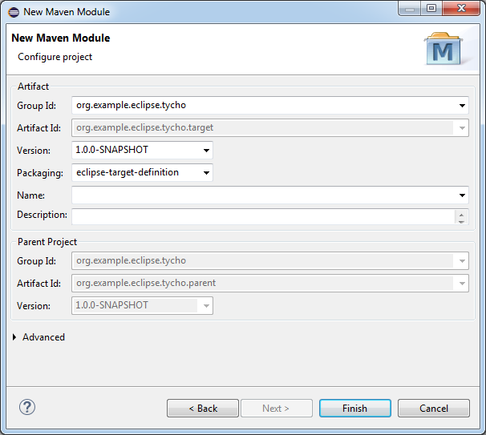
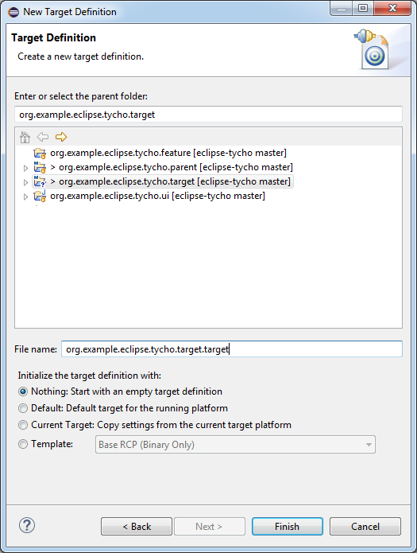
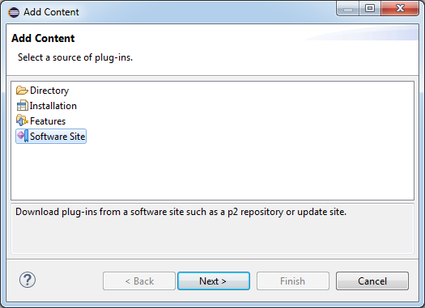
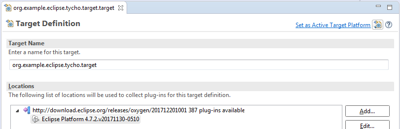
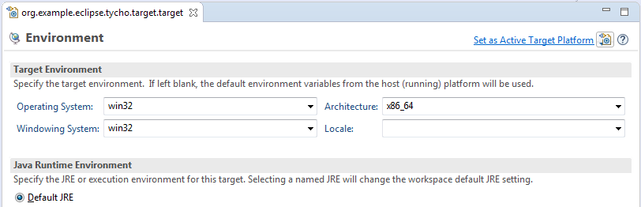
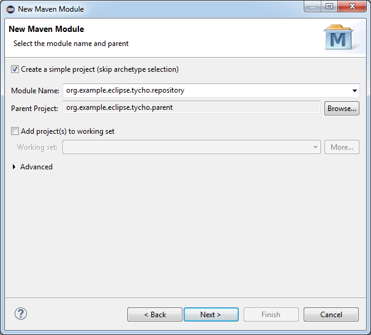
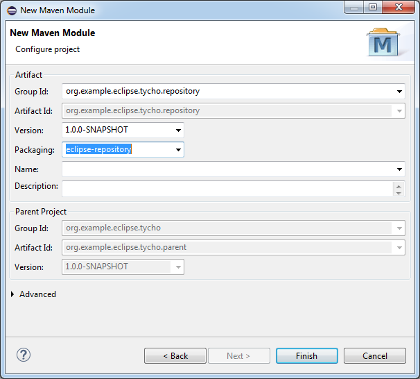
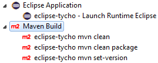

# eclipse-tycho

How to add tycho to an existing eclipse plugin feature...

## Adding Tycho

Below I describe in _Setting up your own project_ the prerequisites of these directions. 
I start with a basic Eclipse feature project and a basic Eclipse plug-in project.

This tutorial is based on the [Tycho Reference Card](https://wiki.eclipse.org/Tycho/Reference_Card "Tycho Reference Card"). 

##### Create Parent POM 

The spirit and purpose of the parent POM is to make the definition of the children
easier. So most of the basic definition is placed in this file. Define a `groupId` and
an `artifactId` for your project and choose as version 1.0.0-SNAPSHOT 
(since all plugins are automatically created with version `1.0.0.qualifier`.  

	<groupId>org.example.eclipse.tycho</groupId>
	<version>1.0.0-SNAPSHOT</version>
	<artifactId>org.example.eclipse.tycho.parent</artifactId>
	<packaging>pom</packaging>

Choose as properties the current tycho version, the java version and the encoding of the
files in your workspace:

	<properties>
		<tycho-version>1.0.0</tycho-version>
		<project.build.sourceEncoding>windows-1252</project.build.sourceEncoding>
		<maven.compiler.source>1.8</maven.compiler.source>
		<maven.compiler.target>1.8</maven.compiler.target>
	</properties>

At this time leave the modules section empty.

Now define the plugins that are needed for the build:

* Compile application sources with eclipse plugin dependencies:
  `org.eclipse.tycho` / `tycho-maven-plugin` / `${tycho-version}`  
* Create a JAR-package containing all the source files of a osgi project.
  `org.eclipse.tycho` / `tycho-source-plugin` / `${tycho-version}`  
* Generate a source feature for projects of packaging type eclipse-feature
  `org.eclipse.tycho` / `tycho-source-feature-plugin` / `${tycho-version}`  
* Generate p2 metadata for the repository
  `org.eclipse.tycho` / `tycho-p2-plugin` / `${tycho-version}`  
* Specify which environments your software should be built for 
  `org.eclipse.tycho` / `target-platform-configuration` / `${tycho-version}`  

Unfortunately Eclipse partially does not know what to do with the plugins and messages like
_Plugin execution not covered by lifecycle configuration: 
org.apache.maven.plugins:maven-clean-plugin:2.5:clean 
(execution: default-clean-1, phase: initialize)_ 
will pop up in your POM editor. To solve this long-standing issue the plugin
`org.eclipse.m2e` / `lifecycle-mapping` was created. This plugin basically
sets the _ignore_ action for the plugin-goal-combination that Eclipse should ignore
in its workspace.

You can find the complete POM in the github repository:
parent [pom.xml](https://github.com/holzem/eclipse-tycho/blob/master/pom.xml "pom.xml") 

##### Add a Target Definition as a Maven Module

Having set the basic information how to compile the eclipse feature the target has to
be defined. Create a new module to hold the target definition to be used by the build.
Be sure to set `eclipse-target-definition` as the packaging of the POM.

 

Now create a target definition for the build, using the desired Eclipse Platform version:

 
 
 
 

##### Define the Eclipse repository for the build

We are still not there. Now we need to define the p2 repository for the build output and create a category manifest.
Make sure to choose `eclipse-repository` as the packaging of the POM.

 

Unfortunately I found no way to create the desired output using the manifest editor. So I chose the XML editor instead:

	<?xml version="1.0" encoding="UTF-8"?>
	<site>
	   <feature id="org.example.eclipse.tycho.feature" version="0.0.0">
	      <category name="main"/>
	   </feature>
	   <feature id="org.example.eclipse.tycho.feature.source" version="0.0.0">
	      <category name="main.source"/>
	   </feature>
	   <category-def name="main" label="Eclipse Tycho Demo"/>
	   <category-def name="main.source" label="Eclipse Tycho Demo (Sources)"/>
	</site>

Since the source feature is created by the build it can not be referenced by the editor.

##### Add POMs for the existing Feature and UI Plug-Ins

Use *Configure --> Convert to Maven Project*  to convert the feature and plug-in projects.
Then add the following `pom.xml` files to the projects:

*Main content of feature/pom.xml*

	<parent>
		<groupId>org.example.eclipse.tycho</groupId>
		<artifactId>org.example.eclipse.tycho.parent</artifactId>
		<version>1.0.0-SNAPSHOT</version>
	</parent>
	<artifactId>org.example.eclipse.tycho.feature</artifactId>
	<packaging>eclipse-feature</packaging>

*Main content of plugin/pom.xml*

	<parent>
		<groupId>org.example.eclipse.tycho</groupId>
		<artifactId>org.example.eclipse.tycho.parent</artifactId>
		<version>1.0.0-SNAPSHOT</version>
	</parent>
	<artifactId>org.example.eclipse.tycho.ui</artifactId>
	<packaging>eclipse-plugin</packaging>

As you can see there is just the reference to the parent POM, the `artifactId`, and
the special eclipse packaging to set.

##### Launch Configurations

I provided the following Eclipse Launch configurations:

* _mvn clean_ cleans up the maven target directories
* _mvn clean package_ creates a p2 repository in the target folder of repository project
* _mvn set-version_ is used to set the next version of the plugins whenever it needs a new version
* _Launch Runtime Eclipse_ starts the plugins in a test workspace

## Setting up your own project

I used Eclipse Oxygen 2 to create the project:

##### Create a Plug-in

The following wizard creates a simple plug-in...

 
 
 
 

##### Create a Feature

Include the plug-in in the feature... 

 
 

##### Export as p2 repository

Basically Eclipse provides everything to create a p2 repository

 
 

This yields a folder structure like:

 

##### Share into a GIT repository

Now you can share the plug-ins into an existing GIT repository with the standard **EGit** share command. 
So far so good.

Now I prepare the next step to add the Maven POMs: I transform the root of the GIT repository to an
Eclipse project. To make it importable I add a `.project` file with the following content. This creates
a Maven parent project, adding the Maven2 builder and nature. We do not need it yet but this gives a nice 
starting point for adding the Maven Tycho build in the next step.

	<?xml version="1.0" encoding="UTF-8"?>
	<projectDescription>
		<name>org.example.eclipse.tycho.parent</name>
		<comment></comment>
		<projects>
		</projects>
		<buildSpec>
			<buildCommand>
				<name>org.eclipse.m2e.core.maven2Builder</name>
				<arguments>
				</arguments>
			</buildCommand>
		</buildSpec>
		<natures>
			<nature>org.eclipse.m2e.core.maven2Nature</nature>
		</natures>
	</projectDescription>

 